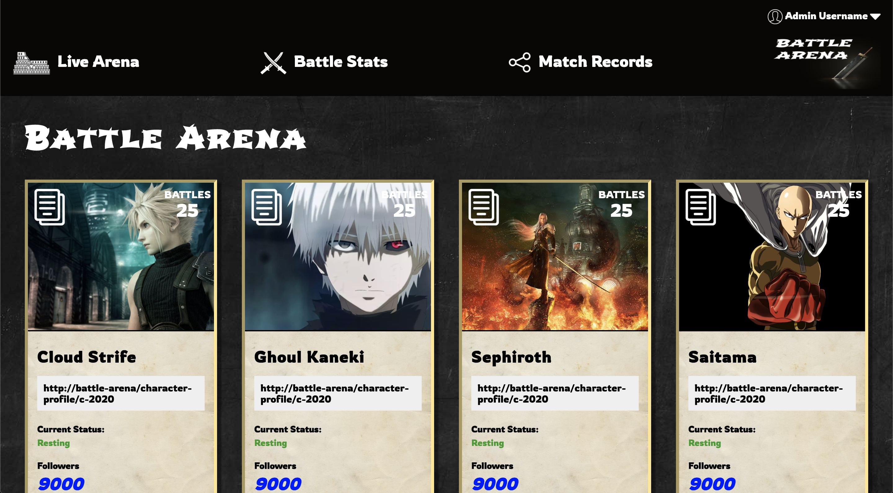

# nd-comp-challenge-1

### Project Objectives:

The objectives in this project were to take the static comp picture before and re-create the layout. The project must follow the structure of the below photo, however it could feature themes, copy and images of my choosing.

__Project Before__

__Project After__

### Learning Points

1. Grid and flexbox can work together. I was always under the impression that it had to be one or the other. Using grid as the structure and flexbox for alignment worked really well for me.

2. Clean code with css is much more achieveable using multiple classes. Have styles you want to propogate through all classes be used an each element and then use other unique class names to set them apart from others.

3. Flex and grid can be really tedious to get right. However, once you understand it and get it placed on the right objects, they work very well together and individually.
